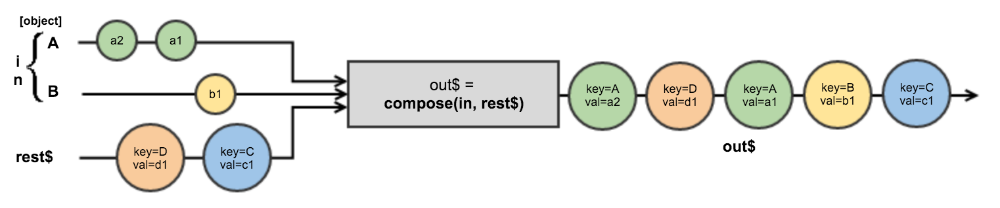
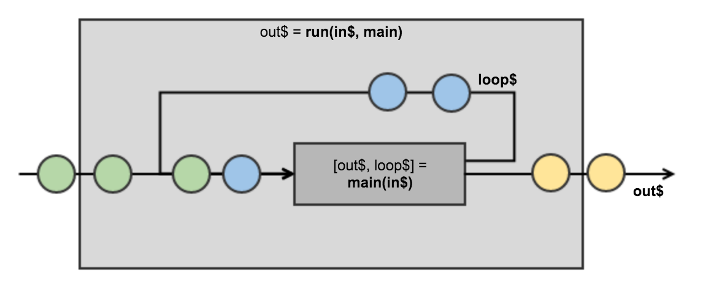

# Hello World!

This example is just a basic "Hello World" application written with
TSERS. It's goal is to teach the basics of TSERS applications. 

### Application

Every TSERS application is **just a pure function** with signature:
```
main :: Transducers => input$ => output$
``` 

Don't let the notation distract you! Let's write the same in JavaScript:
```javascript
import {Observable as O} from "rx"

const main = Transducers => input$ => {
  return O.just("output")
}

export default main 
```

So your TSERS application is just **a function returning a function** which
**takes stream of input signals** (`input$`) and **returns stream of output signals**
(`output$`). Always. 

You may notice that the idea is almost same as in Cycle but in TSERS, signal 
transducers are separated from input signals. The reason for this is that it
allows extremely easy composition: because TSERS application is basically just a signal
processor, you can use **any TSERS application** from other TSERS applications.
And the signature of the `main` is meant to support this (you'll get it after
you've explored the examples :wink:).

So let's take a closer look at those `input$`, `Transducers` and `output$`:

### `input$` 

Input is a stream of input signals coming from "outside world". These signals
can be anything: user keyboard clicks, mouse movements, messages from WebSocket,
sounds from guitar pedals etc etc.

The values of `input$` is are just `{key, value}` pairs where `key` identifies
the signal source and `value` contains the signal's data. And that's all about
input signals.

### Transducers 

[Transducer](https://en.wikipedia.org/wiki/Transducer) is just a function that
transforms / processes signals `a` to `b`:
```
Transducer :: a$ => b$
```

As you can notice, your `main` is actually just another signal transducer. 
Observable's `map`, `filter` and `flatMap` (for example) are also transducers.
And transducers can be composed:
```javascript
const main = Transducers => input$ => {
  const output$ = input$
    .flatMap(msg$ => msg$
      .filter(m => m.type === "tsers")
      .map(m => m.data))
  return output$
}
``` 
Nothing new, huh? That's TSERS!

In order to make your app development easy, TSERS provides a basic set of
common transducers: `decompose`, `run` and `compose`. 

#### `decompose :: (in$, ...keys) => [{[key]: [signals-of-key]}, rest$]`

As told before, `input$` signals are just a stream of key-value pairs. And
`decompose` is just a helper function meant to "extract" specific input signals 
from the rest. 


```javascript
const input$ = O.of({key: "Foo", val: "foo!"}, {key: "Bar", val: "bar"}, {key: "Foo", val: "foo?"}, {key: "lol", val: "bal"})
const [decomposed, rest$] = decompose(input$, "Foo", "Bar")
decomposed.Foo.subscribe(::console.log)   // => "foo!", "foo?"
decomposed.Bar.subscribe(::console.log)   // => "bar"
rest$.subscribe(::console.log)            // =>  {key: "lol", val: "bal"}
```

#### `compose :: ({[key]: [signals-of-key]}, rest$ = O.never()) => output$`

`compose` does exactly opposite as `decompose` - it maps the given signals to
the signals of `{key,value}` pairs and merges them. For convenience, it also
takes rest input signals (key-value pairs) as a second (optional) argument.


```javascipt
const foo$ = O.just("foo!")
const bar$ = O.just("bar..")
const rest$ = O.just({key: "lol", value: "bal"})
const out$ = compose({Foo: foo$, Bar: bar$}, rest$)
out$.subscribe(::console.log)   // => {key: "Foo", val: "foo!"}, {key: "Bar", val: "bar.."}, {key: "lol", val: "bal"}
```

Also note that `compose` and `decompose` are transitive:
```javascript
const input$ = ...
const keys = [ ... ]
const output$ = compose(...decompose(input$, ...keys))
// output$ and input$ streams produce same values
```

#### `run :: (input$, (input$ => [output$, loop$]) => output$`

`run` is the way to loop signals from downstream back to upstream. It takes
input signals and a transducer function producing `output$` and `loop$` signals
array - `output$` signals are passed through as they are, but `loop$` signals
are brought back to the transducer function as input signals.


```javascript
const input$ = compose({Foo: O.just("tsers")})
const main = input$ => {
  const [{Bar: bar$, Foo: foo$}] = decompose(input$, "Bar", "Foo")
  const output$ = bar$.map(x => x + "!")
  const loop$ = compose({Bar: foo$.map(x => x + "?")})
  return [output$, loop$]
}

const output$ = run(input$, main)
output$.subscribe(::console.log)  // => "tsers?!"
```
